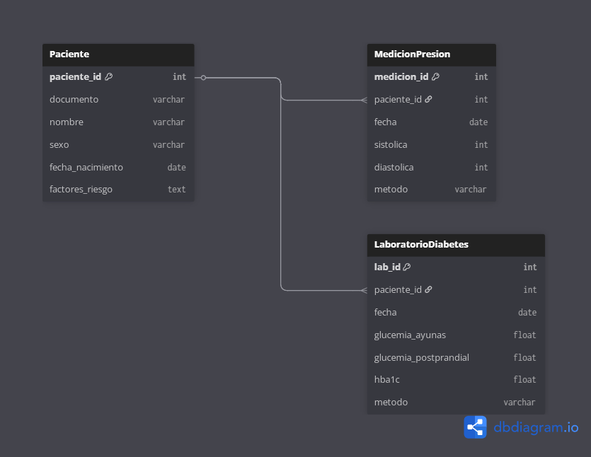

# Modelo de datos clínicos

Este documento describe el **modelo conceptual** previo a la escritura de SQL.  
Se basa en tres entidades principales: **Paciente**, **Medición de presión arterial** y **Laboratorio de diabetes**.

---

## Diagrama ER

> El diagrama muestra las tres entidades y sus relaciones:
> - **Paciente** es la entidad principal.
> - Un paciente puede tener muchas mediciones de presión arterial (1:N).
> - Un paciente puede tener muchos laboratorios de diabetes (1:N).
> - No existe relación directa entre Medición y Laboratorio; ambas dependen de Paciente.

---

## Entidades

### Paciente
- **PK:** paciente_id  
- **Atributos:** documento, nombre, sexo, fecha_nacimiento, factores_riesgo

### Medición de presión arterial
- **PK:** medicion_id  
- **FK:** paciente_id → Paciente  
- **Atributos:** fecha, sistolica, diastolica, metodo

### Laboratorio de diabetes
- **PK:** lab_id  
- **FK:** paciente_id → Paciente  
- **Atributos:** fecha, glucemia_ayunas, glucemia_postprandial, hba1c, metodo

---

## Relaciones

- Un **Paciente** puede tener muchas **Mediciones** (relación 1:N).  
- Un **Paciente** puede tener muchos **Laboratorios** (relación 1:N).  
- No existe relación directa entre **Medición** y **Laboratorio**; ambas dependen de **Paciente**.

---

## Notas

- Este modelo conceptual se documenta antes de escribir SQL para evitar inconsistencias.  
-  y referenciarse en este archivo para mayor claridad.  
